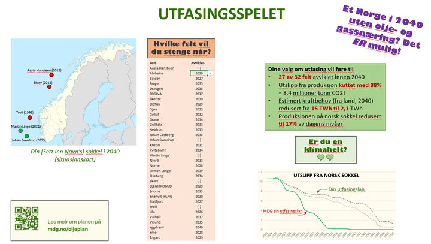

# Phase Out Village

_**Chill, baby! Chill!**_

Phase Out Village is a web game that explores scenarios for phasing out Norwegian oil and gas production

In this simulation, you can plan phase out for each field on the Norwegian continental shelf and see the impact on
emissions, production and on the Norwegian economy.

The simulation uses production data from the Norwegian Petroleum and emission data from Offshore Norway.

## Data provenance

Production data has been collected from [Norwegian Petroleum](https://www.norskpetroleum.no/fakta/felt/aasta-hansteen/)

Emission data has been collected
from [Offshore Norway emission reports](https://www.offshorenorge.no/faginnhold/rapporter/klima-og-miljo/feltspesifikke-utslipp/).
In what seems like an effort of data obstruction, this data in only published as individual PDFs for each oil field for
each year from 2012-2024.
The PDFs have painstakingly been scraped by volunteers at the Norwegian Green Party.

Geographic data has been collected from [Norwegian Offshore Directorate](https://factmaps.sodir.no/)

The data is collected into a [publicly available spreadsheet](https://docs.google.com/spreadsheets/d/1mHusVg0hu4YWcPycictRjjP3GAPjN1yC2V0eTaLupgo/edit?gid=0#gid=0)

As future production is secret and emission is tied to production, the following estimates are used for future values:

- Future production is based on the average of the last five years with a projected depletion of 10% per year
- Average emission intensity is set to the average of the last five years
  - For selected oil fields, the total emission is set to be constant as the emissions mainly based on constant
    factors
- For future electricity consumption, the future consumption uses the last known value scaled by production volume
- The user can select whether to use the USD 80 as a future oil price, adjust the oil price by a yearly percentage
  between -5% and +5% (official scenarios seem to be a bit above +2%) or set a price for each year
- Revenue is estimated as a percentage of the market price of the production volume, based on past trends.
  78% of the revenue is calculated as the tax revenue. We set an estimated dividend percentage for each oil field
  based on historical values

## Features

- For each oil field, the user can select an phase out year between 2027 and 2040
- All Norwegian oil fields are displayed on a map with a shading that shows their emission intensity. When the user
  selects a phase out year for any field, the total contribution of each field determines the shading instead
- A graph displays the emission of the current projected production. When the user selects a production end data for an
  oil field, their production graph is displayed alongside the baseline
- Similarly to emissions, a graph of production for the baseline scenario and the user's planned scenario is displayed
- Similarly to emissions and production, a graph of revenue for the baseline scenario and the user's planned scenario is
  displayed. The revenue is divided into fund contributions and direct budget contributions
- When the user selects an oil field, the graphs are limited to that oil field

## Inspirational idea

## Technology

This game is a purely frontend application developed with React. OpenLayers are used for the maps and Chart.js for the
charts. The game is optimized for mobile display format.

The development language is English. The UI language is Norwegian.
